# 📊 SaaS Workflow Diagrams - Mermaid

هذا الملف يحتوي على جميع الرسوم البيانية للـ SaaS Onboarding Workflow بصيغة Mermaid.

---

## 1. High-Level Architecture

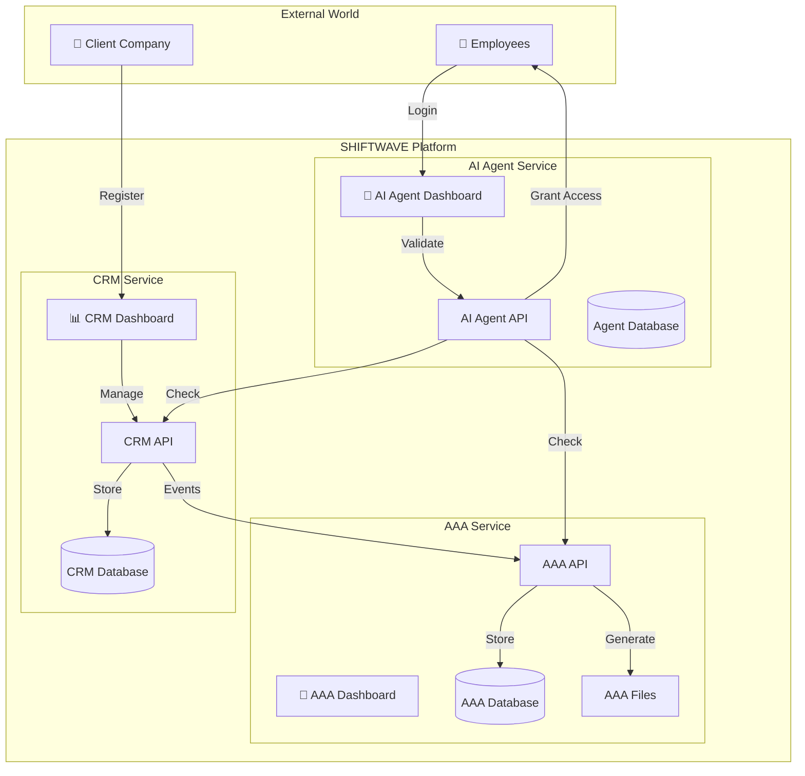

---

## 2. Complete Onboarding Sequence

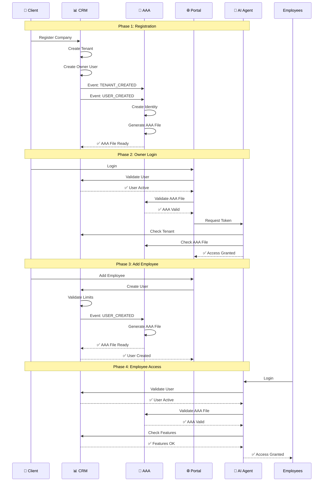

---

## 3. Data Flow Diagram

```mermaid
flowchart TD
    Start([Client Registers]) --> CreateTenant[CRM: Create Tenant]
    CreateTenant --> CreateOwner[CRM: Create Owner User]
    CreateOwner --> SendEvents[CRM: Send Events]
    
    SendEvents --> Event1[TENANT_CREATED Event]
    SendEvents --> Event2[USER_CREATED Event]
    
    Event1 --> AAAInit[AAA: Initialize Tenant]
    Event2 --> AAACreate[AAA: Create Identity]
    
    AAAInit --> AAAPolicies[AAA: Create Policies]
    AAACreate --> AAAFile[AAA: Generate AAA File]
    
    AAAFile --> StoreAAA[Store AAA File]
    StoreAAA --> Ready[✅ Ready for Login]
    
    Ready --> Login[User Logs In]
    Login --> ValidateJWT[Validate JWT Token]
    ValidateJWT --> CheckCRM[Check CRM Status]
    CheckCRM --> CheckAAA[Check AAA File]
    CheckAAA --> CheckSub[Check Subscription]
    CheckSub --> GrantAccess[✅ Grant Access]
    
    GrantAccess --> UseService[User Uses Service]
    UseService --> CheckPerm[Check Permissions]
    CheckPerm --> Allow[✅ Allow] | Deny[❌ Deny]
```

---

## 4. Multi-Tenant Isolation

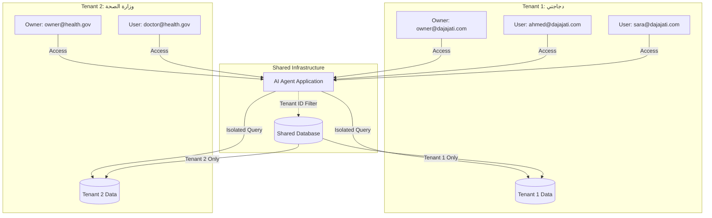

---

## 5. Permission Check Flow

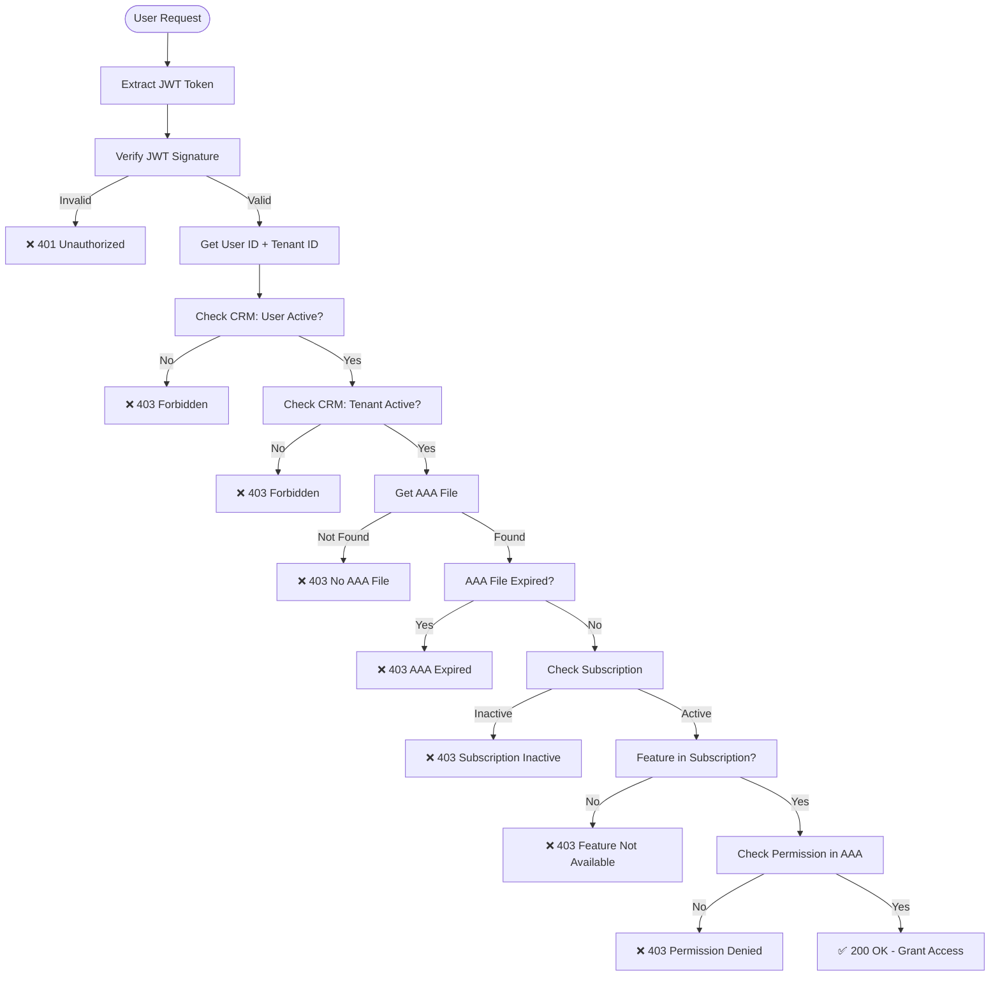

---

## 6. Event-Driven Architecture

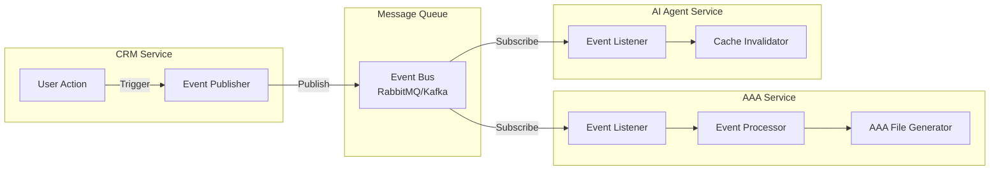

---

## 7. Subscription & Feature Gating

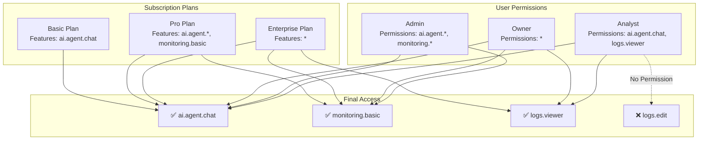

---

## 8. AAA File Structure

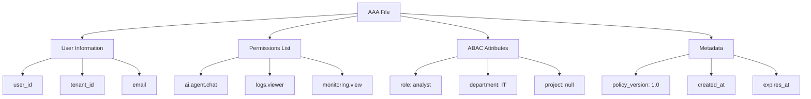

---

## 9. Error Handling Flow

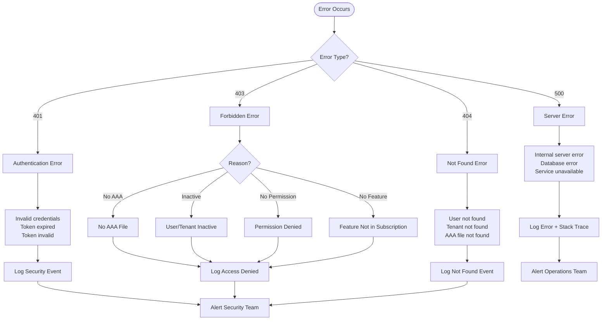

---

## 10. Deployment Architecture

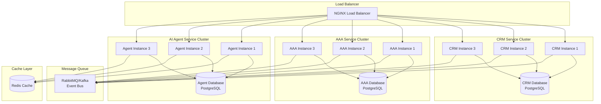

---

## 11. Security Layers

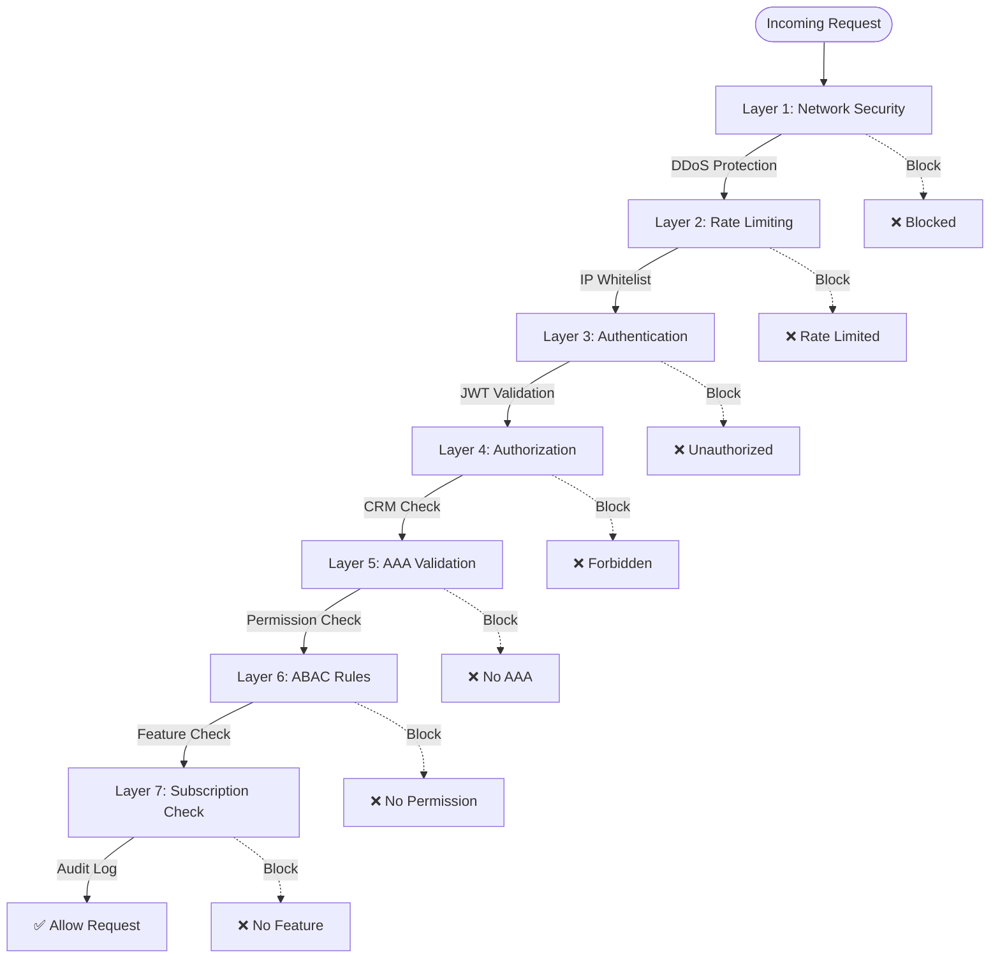

---

## 12. Monitoring & Observability

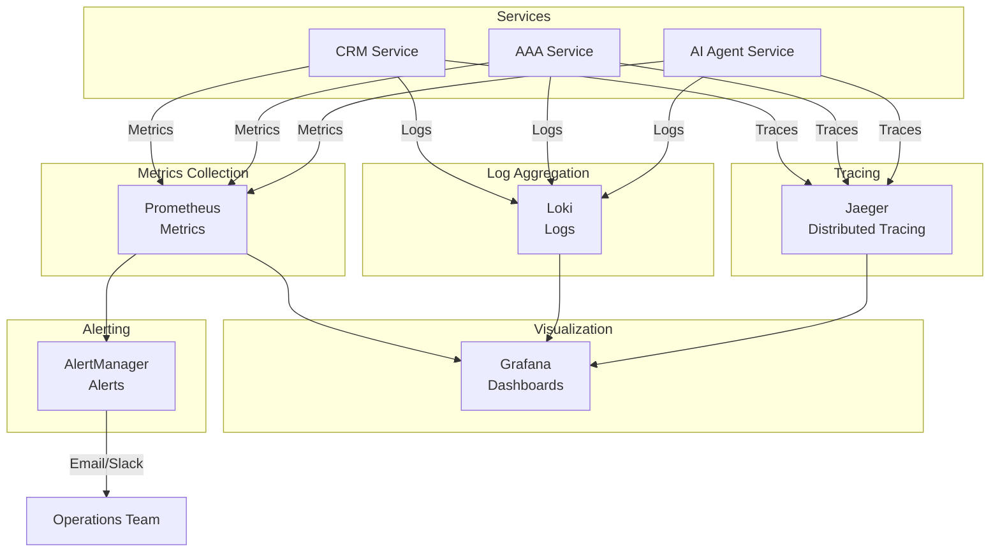

---

## كيفية استخدام هذه الرسوم البيانية

### في Markdown
```markdown
```mermaid
[Paste diagram code here]
```
```

### في Mermaid Live Editor
1. افتح [https://mermaid.live](https://mermaid.live)
2. الصق كود الرسم البياني
3. احفظ كـ PNG أو SVG

### في GitHub/GitLab
GitHub و GitLab يدعمان Mermaid تلقائياً في ملفات Markdown.

### في الوثائق
يمكن استخدام هذه الرسوم في:
- README.md
- API Documentation
- Architecture Documentation
- Presentations

---

**تم إنشاء هذا الملف بواسطة:** Shiftwave Team  
**آخر تحديث:** 2024-01-15  
**الإصدار:** 1.0.0

