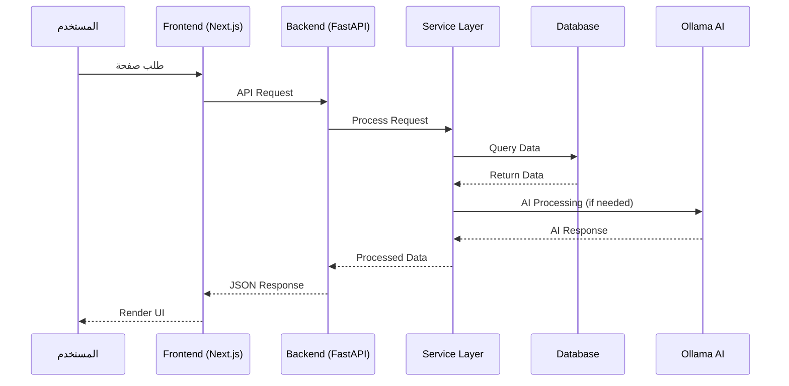
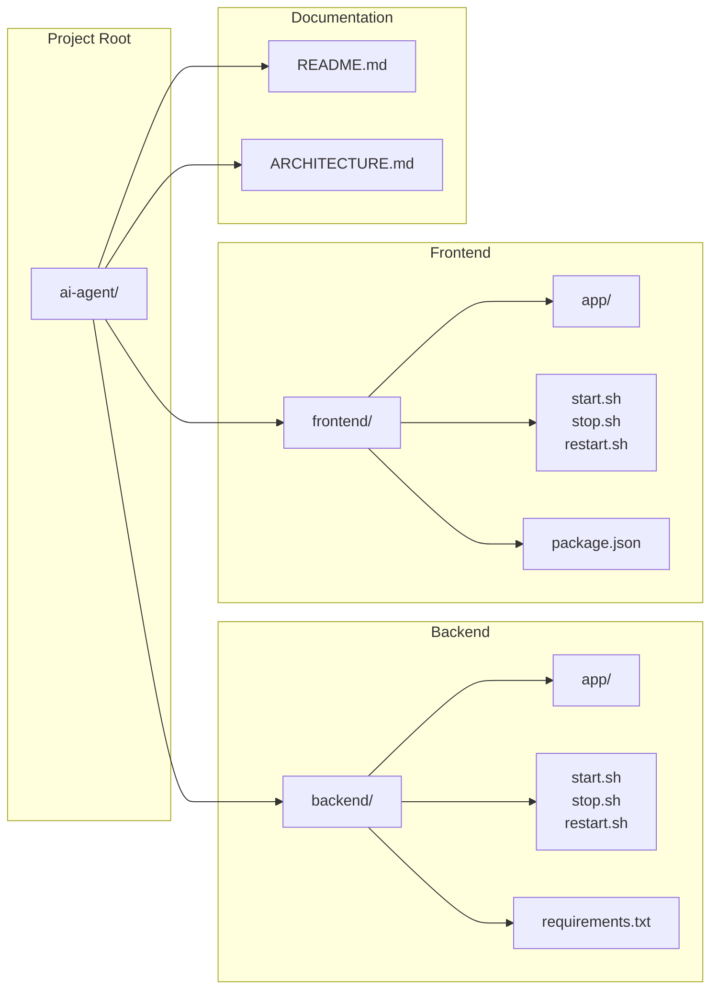

# AI Agent System Architecture - مخطط البنية المعمارية

## 📊 مخطط النظام الكامل

```mermaid
graph TB
    subgraph "Frontend - Next.js (Port 3000)"
        UI[واجهة المستخدم]
        
        subgraph "الصفحات الرئيسية"
            HOME[الصفحة الرئيسية<br/>Agent Console]
            MONITOR[Monitoring<br/>مراقبة النظام]
            LOGS[Logs<br/>السجلات]
            TOOLS[Tools<br/>الأدوات]
        end
        
        subgraph "ميزات DevOps"
            CICD[CI/CD<br/>النشر التلقائي]
            DEBUGGER[AI Debugger<br/>مصحح الأخطاء]
            BACKUP[Backup & Restore<br/>النسخ الاحتياطي]
            WORKFLOWS[Workflows<br/>سير العمل]
        end
        
        subgraph "ميزات الأمان"
            SECURITY[Security Center<br/>مركز الأمان]
            SIEM[SIEM/SOC<br/>مراقبة الأمان]
            THREAT[Threat Detection<br/>كشف التهديدات]
            ABAC[ABAC Access Control<br/>التحكم بالوصول]
        end
        
        subgraph "ميزات الإدارة"
            TENANTS[Tenants<br/>المواقع]
            BILLING[Billing<br/>الفواتير]
            APPROVALS[Approvals<br/>الموافقات]
            SETTINGS[Settings<br/>الإعدادات]
        end
        
        subgraph "ميزات متقدمة"
            VISUALIZATION[Visualization<br/>التصور]
            KNOWLEDGE[Knowledge Base<br/>قاعدة المعرفة]
            AUDIT[Audit Trail<br/>سجل التدقيق]
            INCIDENTS[Incidents<br/>الحوادث]
        end
        
        subgraph "ميزات AI المتقدمة"
            COST[Cost Analyzer<br/>تحليل التكاليف]
            PERFORMANCE[Performance Tuner<br/>ضبط الأداء]
            GLOBAL[Global Search<br/>البحث الشامل]
            SNAPSHOTS[Snapshots & Rollback<br/>اللقطات]
            INCIDENT_CENTER[Incident Command Center<br/>مركز قيادة الحوادث]
            SECRETS[Secret Management<br/>إدارة الأسرار]
            DEPENDENCY[Service Dependency<br/>تبعيات الخدمات]
            KERNEL[Kernel Metrics<br/>مقاييس النواة]
            HARDENING[Auto-Hardening<br/>التأمين التلقائي]
            SHADOW[Shadow Deployment<br/>النشر الخفي]
            BEHAVIOR[Behavior Alerts<br/>تنبيهات السلوك]
            BLUEPRINT[Blueprint Generator<br/>مولد المخططات]
            CODE_REVIEW[Code Review<br/>مراجعة الكود]
            PLUGINS[Plugin Store<br/>متجر الإضافات]
            WORKFLOW_BUILDER[Workflow Builder<br/>بناء سير العمل]
            AGENT_MESH[Agent Mesh<br/>شبكة الوكلاء]
            DIGITAL_TWIN[Digital Twin<br/>التوأم الرقمي]
        end
    end
    
    subgraph "Backend - FastAPI (Port 8000)"
        API[FastAPI Server]
        
        subgraph "Core APIs"
            AUTH_API[Auth API]
            CHAT_API[Chat API]
            LOGS_API[Logs API]
            TOOLS_API[Tools API]
            MONITOR_API[Monitor API]
        end
        
        subgraph "DevOps APIs"
            CICD_API[CI/CD API]
            DEBUGGER_API[Debugger API]
            BACKUP_API[Backup API]
            WORKFLOWS_API[Workflows API]
        end
        
        subgraph "Security APIs"
            SECURITY_API[Security API]
            THREAT_API[Threat Detection API]
            ABAC_API[ABAC API]
        end
        
        subgraph "Management APIs"
            BILLING_API[Billing API]
            APPROVALS_API[Approvals API]
            PERMISSIONS_API[Permissions API]
            SETTINGS_API[Settings API]
        end
        
        subgraph "Advanced APIs"
            VISUALIZATION_API[Visualization API]
            AUDIT_API[Audit API]
            INCIDENTS_API[Incidents API]
            MONITORING_API[Monitoring API]
        end
        
        subgraph "AI Advanced APIs"
            COST_API[Cost Analyzer API]
            PERFORMANCE_API[Performance Tuner API]
            GLOBAL_API[Global Search API]
            SNAPSHOTS_API[Snapshots API]
            INCIDENT_CENTER_API[Incident Center API]
            SECRETS_API[Secrets API]
            DEPENDENCY_API[Dependency API]
            KERNEL_API[Kernel Metrics API]
            HARDENING_API[Hardening API]
            SHADOW_API[Shadow Deployment API]
            BEHAVIOR_API[Behavior Alerts API]
            BLUEPRINT_API[Blueprint API]
            CODE_REVIEW_API[Code Review API]
            PLUGINS_API[Plugins API]
            WORKFLOW_BUILDER_API[Workflow Builder API]
            AGENT_MESH_API[Agent Mesh API]
            DIGITAL_TWIN_API[Digital Twin API]
        end
        
        subgraph "Services Layer"
            SECURITY_SERVICE[Security Service]
            MONITORING_SERVICE[Monitoring Service]
            BACKUP_SERVICE[Backup Service]
            WORKFLOW_SERVICE[Workflow Service]
            INCIDENT_SERVICE[Incident Service]
            AI_SERVICES[AI Services<br/>Ollama Integration]
        end
        
        subgraph "Data Layer"
            DB[(SQLite Database)]
            MEMORY[Memory Storage]
            LOGS_STORAGE[Logs Storage]
        end
    end
    
    subgraph "External Services"
        OLLAMA[Ollama<br/>Local AI<br/>Port 11434]
        PROMETHEUS[Prometheus<br/>Metrics<br/>Port 9090]
        GRAFANA[Grafana<br/>Visualization<br/>Port 3001]
    end
    
    %% Frontend to Backend Connections
    HOME --> API
    MONITOR --> API
    LOGS --> API
    TOOLS --> API
    CICD --> API
    DEBUGGER --> API
    BACKUP --> API
    WORKFLOWS --> API
    SECURITY --> API
    SIEM --> API
    THREAT --> API
    ABAC --> API
    TENANTS --> API
    BILLING --> API
    APPROVALS --> API
    SETTINGS --> API
    VISUALIZATION --> API
    KNOWLEDGE --> API
    AUDIT --> API
    INCIDENTS --> API
    COST --> API
    PERFORMANCE --> API
    GLOBAL --> API
    SNAPSHOTS --> API
    INCIDENT_CENTER --> API
    SECRETS --> API
    DEPENDENCY --> API
    KERNEL --> API
    HARDENING --> API
    SHADOW --> API
    BEHAVIOR --> API
    BLUEPRINT --> API
    CODE_REVIEW --> API
    PLUGINS --> API
    WORKFLOW_BUILDER --> API
    AGENT_MESH --> API
    DIGITAL_TWIN --> API
    
    %% Backend API to Service Connections
    AUTH_API --> SECURITY_SERVICE
    CHAT_API --> AI_SERVICES
    MONITOR_API --> MONITORING_SERVICE
    SECURITY_API --> SECURITY_SERVICE
    BACKUP_API --> BACKUP_SERVICE
    WORKFLOWS_API --> WORKFLOW_SERVICE
    INCIDENTS_API --> INCIDENT_SERVICE
    THREAT_API --> SECURITY_SERVICE
    COST_API --> AI_SERVICES
    PERFORMANCE_API --> AI_SERVICES
    
    %% Services to Data Layer
    SECURITY_SERVICE --> DB
    MONITORING_SERVICE --> DB
    BACKUP_SERVICE --> MEMORY
    WORKFLOW_SERVICE --> DB
    INCIDENT_SERVICE --> DB
    AI_SERVICES --> MEMORY
    
    %% External Services
    AI_SERVICES --> OLLAMA
    MONITORING_SERVICE --> PROMETHEUS
    VISUALIZATION_API --> GRAFANA
    
    style UI fill:#3b82f6,color:#fff
    style API fill:#10b981,color:#fff
    style OLLAMA fill:#f59e0b,color:#fff
    style DB fill:#8b5cf6,color:#fff
    style PROMETHEUS fill:#e11d48,color:#fff
    style GRAFANA fill:#f97316,color:#fff
```

## 🔄 تدفق البيانات

## 🏗️ بنية الملفات

## 📦 المكونات الرئيسية

### Frontend Components
- **Layout**: `app/layout.tsx` - التخطيط الرئيسي
- **Pages**: 31 صفحة في `app/*/page.tsx`
- **Components**: مكونات قابلة لإعادة الاستخدام في `components/`
- **Lib**: مكتبات مساعدة في `lib/`

### Backend Components
- **Main**: `app/main.py` - نقطة الدخول الرئيسية
- **APIs**: 50+ router في `app/api/`
- **Services**: خدمات الأعمال في `app/services/`
- **Core**: الإعدادات والصلاحيات في `app/core/`

## 🔌 الاتصالات

- **Frontend ↔ Backend**: HTTP REST API على Port 8000
- **Backend ↔ Ollama**: HTTP API على Port 11434
- **Backend ↔ Prometheus**: Metrics scraping على Port 9090
- **Backend ↔ Grafana**: Data source على Port 3001

