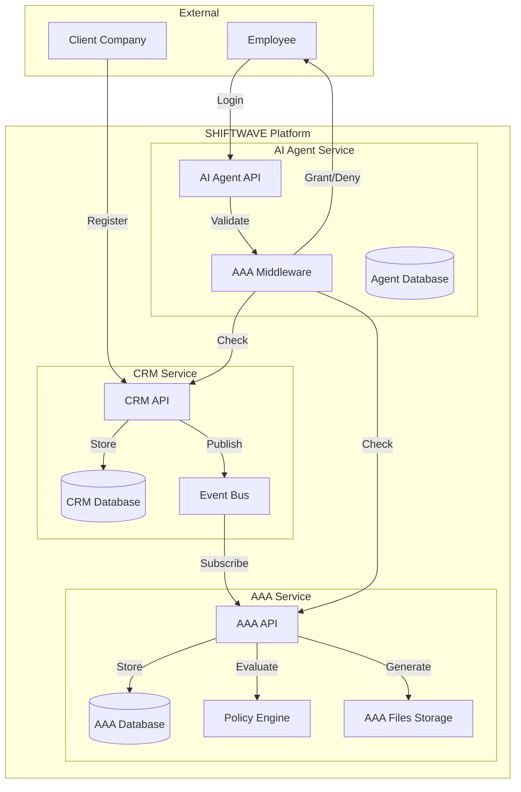

# 🛠️ SaaS Implementation Guide - Technical Details

## 📋 نظرة عامة

هذا المستند يحتوي على التفاصيل التقنية لتنفيذ الـ SaaS Onboarding Workflow.

---

## 🏗️ Architecture Overview



---

## 🔐 AAA Middleware Implementation

### Core Middleware Code

```python
# backend/app/core/aaa_middleware.py

from fastapi import Depends, HTTPException, status
from sqlalchemy.orm import Session
from typing import Dict, Any, Optional
from app.core.database import get_db
from app.core.security import verify_token
from app.identity import service as identity_service
from app.crm import service as crm_service
from app.subscription import service as subscription_service

async def get_current_user_context(
    credentials: Optional[HTTPAuthorizationCredentials] = Depends(HTTPBearer()),
    db: Session = Depends(get_db)
) -> Dict[str, Any]:
    """
    AAA Middleware - Validates user access using CRM + AAA.
    
    This is the core validation function that every AI Agent endpoint uses.
    """
    if not credentials:
        raise HTTPException(
            status_code=status.HTTP_401_UNAUTHORIZED,
            detail="Authentication required"
        )
    
    token = credentials.credentials
    
    # Step 1: Verify JWT token
    payload = verify_token(token)
    if not payload:
        raise HTTPException(
            status_code=status.HTTP_401_UNAUTHORIZED,
            detail="Invalid token"
        )
    
    user_id = payload.get("sub")
    tenant_id = payload.get("tenant_id")
    
    if not user_id or not tenant_id:
        raise HTTPException(
            status_code=status.HTTP_401_UNAUTHORIZED,
            detail="Invalid token payload"
        )
    
    # Step 2: Validate against CRM (Master Source of Truth)
    try:
        user = identity_service.IdentityService.get_user_by_id(db, int(user_id))
        if not user:
            raise HTTPException(
                status_code=status.HTTP_404_NOT_FOUND,
                detail="User not found in CRM"
            )
        
        if user.status != "active":
            raise HTTPException(
                status_code=status.HTTP_403_FORBIDDEN,
                detail="User is not active"
            )
        
        tenant = identity_service.IdentityService.get_tenant_by_id(db, tenant_id)
        if not tenant:
            raise HTTPException(
                status_code=status.HTTP_404_NOT_FOUND,
                detail="Tenant not found in CRM"
            )
        
        if tenant.status != "active":
            raise HTTPException(
                status_code=status.HTTP_403_FORBIDDEN,
                detail="Tenant is not active"
            )
        
        # Get tenant user relationship
        tenant_user = identity_service.IdentityService.get_tenant_user(
            db, tenant_id, user_id
        )
        if not tenant_user or tenant_user.status != "active":
            raise HTTPException(
                status_code=status.HTTP_403_FORBIDDEN,
                detail="User is not active in tenant"
            )
        
    except HTTPException:
        raise
    except Exception as e:
        raise HTTPException(
            status_code=status.HTTP_500_INTERNAL_SERVER_ERROR,
            detail=f"CRM validation error: {str(e)}"
        )
    
    # Step 3: Validate AAA file exists
    try:
        from app.access import service as access_service
        aaa_file = access_service.AccessService.get_aaa_file(db, tenant_id, user_id)
        
        if not aaa_file:
            raise HTTPException(
                status_code=status.HTTP_403_FORBIDDEN,
                detail="AAA file not found - user not provisioned"
            )
        
        # Check if AAA file is expired
        if aaa_file.expires_at and aaa_file.expires_at < datetime.utcnow():
            raise HTTPException(
                status_code=status.HTTP_403_FORBIDDEN,
                detail="AAA file expired"
            )
        
    except HTTPException:
        raise
    except Exception as e:
        raise HTTPException(
            status_code=status.HTTP_500_INTERNAL_SERVER_ERROR,
            detail=f"AAA validation error: {str(e)}"
        )
    
    # Step 4: Check subscription status
    try:
        subscription_status = subscription_service.SubscriptionService.check_subscription_status(
            db, tenant_id
        )
        
        if not subscription_status.get("is_active"):
            raise HTTPException(
                status_code=status.HTTP_403_FORBIDDEN,
                detail="Subscription is not active"
            )
        
    except HTTPException:
        raise
    except Exception as e:
        raise HTTPException(
            status_code=status.HTTP_500_INTERNAL_SERVER_ERROR,
            detail=f"Subscription validation error: {str(e)}"
        )
    
    # Step 5: Return enriched user context
    return {
        "user_id": str(user.id),
        "email": user.email,
        "full_name": user.full_name,
        "tenant_id": str(tenant.id),
        "tenant_name": tenant.name,
        "role": tenant_user.role,
        "permissions": aaa_file.permissions or [],
        "abac_attributes": aaa_file.abac_attributes or {},
        "subscription": subscription_status.get("subscription"),
        "aaa_file": aaa_file
    }


def require_permission(permission: str):
    """
    Decorator to require specific permission.
    
    Usage:
        @router.get("/api/agent/chat")
        async def chat(
            user_context: dict = Depends(require_permission("ai.agent.chat"))
        ):
            ...
    """
    def permission_checker(
        user_context: Dict[str, Any] = Depends(get_current_user_context)
    ) -> Dict[str, Any]:
        permissions = user_context.get("permissions", [])
        
        # Check exact permission
        if permission in permissions:
            return user_context
        
        # Check wildcard permissions (e.g., "ai.agent.*" matches "ai.agent.chat")
        for perm in permissions:
            if perm.endswith(".*"):
                prefix = perm[:-2]  # Remove ".*"
                if permission.startswith(prefix + "."):
                    return user_context
        
        # Check if user has "*" (all permissions)
        if "*" in permissions or "admin" in user_context.get("role", ""):
            return user_context
        
        raise HTTPException(
            status_code=status.HTTP_403_FORBIDDEN,
            detail=f"Permission denied: {permission} required"
        )
    
    return permission_checker


def require_feature(feature: str):
    """
    Decorator to require feature in subscription.
    
    Usage:
        @router.get("/api/monitoring")
        async def monitoring(
            user_context: dict = Depends(require_feature("monitoring.basic"))
        ):
            ...
    """
    def feature_checker(
        user_context: Dict[str, Any] = Depends(get_current_user_context)
    ) -> Dict[str, Any]:
        subscription = user_context.get("subscription")
        if not subscription:
            raise HTTPException(
                status_code=status.HTTP_403_FORBIDDEN,
                detail="No active subscription"
            )
        
        features = subscription.get("features", [])
        
        # Check exact feature
        if feature in features:
            return user_context
        
        # Check wildcard features
        for feat in features:
            if feat.endswith(".*"):
                prefix = feat[:-2]
                if feature.startswith(prefix + "."):
                    return user_context
        
        raise HTTPException(
            status_code=status.HTTP_403_FORBIDDEN,
            detail=f"Feature not available in subscription: {feature}"
        )
    
    return feature_checker
```

---

## 📡 Event System Implementation

### CRM Event Publisher

```python
# backend/app/crm/events.py

from typing import Dict, Any
import httpx
import logging
from app.core.config import get_settings

logger = logging.getLogger(__name__)
settings = get_settings()

class CRMEventPublisher:
    """Publishes events from CRM to AAA service."""
    
    AAA_SERVICE_URL = settings.AAA_SERVICE_URL or "http://localhost:8000"
    
    @staticmethod
    async def publish_tenant_created(tenant_data: Dict[str, Any]):
        """Publish TENANT_CREATED event to AAA."""
        event = {
            "event": "TENANT_CREATED",
            "tenant_id": str(tenant_data["id"]),
            "name": tenant_data["name"],
            "type": tenant_data["type"],
            "subscription_plan": tenant_data.get("subscription_plan"),
            "max_users": tenant_data.get("max_users"),
            "features": tenant_data.get("features", []),
            "timestamp": datetime.utcnow().isoformat()
        }
        
        try:
            async with httpx.AsyncClient() as client:
                response = await client.post(
                    f"{CRMEventPublisher.AAA_SERVICE_URL}/api/aaa/events/tenant-created",
                    json=event,
                    timeout=10.0
                )
                response.raise_for_status()
                logger.info(f"Published TENANT_CREATED event for tenant {tenant_data['id']}")
        except Exception as e:
            logger.error(f"Failed to publish TENANT_CREATED event: {e}")
            # In production, use message queue (RabbitMQ, Kafka, etc.)
            raise
    
    @staticmethod
    async def publish_user_created(user_data: Dict[str, Any], tenant_id: str):
        """Publish USER_CREATED event to AAA."""
        event = {
            "event": "USER_CREATED",
            "user_id": str(user_data["id"]),
            "tenant_id": tenant_id,
            "email": user_data["email"],
            "full_name": user_data.get("full_name"),
            "role": user_data.get("role", "member"),
            "permissions": user_data.get("permissions", []),
            "status": user_data.get("status", "active"),
            "timestamp": datetime.utcnow().isoformat()
        }
        
        try:
            async with httpx.AsyncClient() as client:
                response = await client.post(
                    f"{CRMEventPublisher.AAA_SERVICE_URL}/api/aaa/events/user-created",
                    json=event,
                    timeout=10.0
                )
                response.raise_for_status()
                logger.info(f"Published USER_CREATED event for user {user_data['id']}")
        except Exception as e:
            logger.error(f"Failed to publish USER_CREATED event: {e}")
            raise
    
    @staticmethod
    async def publish_user_updated(user_data: Dict[str, Any], tenant_id: str):
        """Publish USER_UPDATED event to AAA."""
        event = {
            "event": "USER_UPDATED",
            "user_id": str(user_data["id"]),
            "tenant_id": tenant_id,
            "email": user_data["email"],
            "role": user_data.get("role"),
            "permissions": user_data.get("permissions", []),
            "status": user_data.get("status"),
            "timestamp": datetime.utcnow().isoformat()
        }
        
        try:
            async with httpx.AsyncClient() as client:
                response = await client.post(
                    f"{CRMEventPublisher.AAA_SERVICE_URL}/api/aaa/events/user-updated",
                    json=event,
                    timeout=10.0
                )
                response.raise_for_status()
                logger.info(f"Published USER_UPDATED event for user {user_data['id']}")
        except Exception as e:
            logger.error(f"Failed to publish USER_UPDATED event: {e}")
            raise
    
    @staticmethod
    async def publish_user_deleted(user_id: str, tenant_id: str):
        """Publish USER_DELETED event to AAA."""
        event = {
            "event": "USER_DELETED",
            "user_id": user_id,
            "tenant_id": tenant_id,
            "timestamp": datetime.utcnow().isoformat()
        }
        
        try:
            async with httpx.AsyncClient() as client:
                response = await client.post(
                    f"{CRMEventPublisher.AAA_SERVICE_URL}/api/aaa/events/user-deleted",
                    json=event,
                    timeout=10.0
                )
                response.raise_for_status()
                logger.info(f"Published USER_DELETED event for user {user_id}")
        except Exception as e:
            logger.error(f"Failed to publish USER_DELETED event: {e}")
            raise
```

---

### AAA Event Handler

```python
# backend/app/identity/event_handlers.py

from fastapi import APIRouter, HTTPException, status
from sqlalchemy.orm import Session
from typing import Dict, Any
from app.core.database import get_db
from app.identity import service as identity_service
from app.access import service as access_service
import logging

logger = logging.getLogger(__name__)
router = APIRouter(prefix="/api/aaa/events", tags=["AAA Events"])


@router.post("/tenant-created")
async def handle_tenant_created(
    event: Dict[str, Any],
    db: Session = Depends(get_db)
):
    """Handle TENANT_CREATED event from CRM."""
    try:
        tenant_id = event.get("tenant_id")
        if not tenant_id:
            raise HTTPException(
                status_code=status.HTTP_400_BAD_REQUEST,
                detail="tenant_id is required"
            )
        
        # Create tenant policies
        access_service.AccessService.initialize_tenant_policies(
            db, tenant_id, event.get("features", [])
        )
        
        logger.info(f"Initialized AAA policies for tenant {tenant_id}")
        return {"status": "success", "tenant_id": tenant_id}
        
    except Exception as e:
        logger.error(f"Error handling TENANT_CREATED event: {e}")
        raise HTTPException(
            status_code=status.HTTP_500_INTERNAL_SERVER_ERROR,
            detail=str(e)
        )


@router.post("/user-created")
async def handle_user_created(
    event: Dict[str, Any],
    db: Session = Depends(get_db)
):
    """Handle USER_CREATED event from CRM."""
    try:
        user_id = event.get("user_id")
        tenant_id = event.get("tenant_id")
        
        if not user_id or not tenant_id:
            raise HTTPException(
                status_code=status.HTTP_400_BAD_REQUEST,
                detail="user_id and tenant_id are required"
            )
        
        # Generate AAA file
        aaa_file = access_service.AccessService.generate_aaa_file(
            db,
            tenant_id=tenant_id,
            user_id=user_id,
            role=event.get("role", "member"),
            permissions=event.get("permissions", []),
            abac_attributes={
                "role": event.get("role", "member"),
                "department": event.get("department"),
                "project": event.get("project")
            }
        )
        
        logger.info(f"Generated AAA file for user {user_id} in tenant {tenant_id}")
        return {
            "status": "success",
            "user_id": user_id,
            "tenant_id": tenant_id,
            "aaa_file_id": str(aaa_file.id)
        }
        
    except Exception as e:
        logger.error(f"Error handling USER_CREATED event: {e}")
        raise HTTPException(
            status_code=status.HTTP_500_INTERNAL_SERVER_ERROR,
            detail=str(e)
        )


@router.post("/user-updated")
async def handle_user_updated(
    event: Dict[str, Any],
    db: Session = Depends(get_db)
):
    """Handle USER_UPDATED event from CRM."""
    try:
        user_id = event.get("user_id")
        tenant_id = event.get("tenant_id")
        
        if not user_id or not tenant_id:
            raise HTTPException(
                status_code=status.HTTP_400_BAD_REQUEST,
                detail="user_id and tenant_id are required"
            )
        
        # Regenerate AAA file with new permissions
        aaa_file = access_service.AccessService.regenerate_aaa_file(
            db,
            tenant_id=tenant_id,
            user_id=user_id,
            role=event.get("role"),
            permissions=event.get("permissions", []),
            status=event.get("status")
        )
        
        logger.info(f"Regenerated AAA file for user {user_id} in tenant {tenant_id}")
        return {
            "status": "success",
            "user_id": user_id,
            "tenant_id": tenant_id,
            "aaa_file_id": str(aaa_file.id)
        }
        
    except Exception as e:
        logger.error(f"Error handling USER_UPDATED event: {e}")
        raise HTTPException(
            status_code=status.HTTP_500_INTERNAL_SERVER_ERROR,
            detail=str(e)
        )


@router.post("/user-deleted")
async def handle_user_deleted(
    event: Dict[str, Any],
    db: Session = Depends(get_db)
):
    """Handle USER_DELETED event from CRM."""
    try:
        user_id = event.get("user_id")
        tenant_id = event.get("tenant_id")
        
        if not user_id or not tenant_id:
            raise HTTPException(
                status_code=status.HTTP_400_BAD_REQUEST,
                detail="user_id and tenant_id are required"
            )
        
        # Mark AAA file as deleted (soft delete)
        access_service.AccessService.delete_aaa_file(
            db, tenant_id, user_id
        )
        
        logger.info(f"Deleted AAA file for user {user_id} in tenant {tenant_id}")
        return {
            "status": "success",
            "user_id": user_id,
            "tenant_id": tenant_id
        }
        
    except Exception as e:
        logger.error(f"Error handling USER_DELETED event: {e}")
        raise HTTPException(
            status_code=status.HTTP_500_INTERNAL_SERVER_ERROR,
            detail=str(e)
        )
```

---

## 📝 AAA File Generator

```python
# backend/app/access/aaa_file_generator.py

from sqlalchemy.orm import Session
from typing import Dict, Any, List, Optional
from datetime import datetime, timedelta
from uuid import UUID
import json

from app.access.models import AAAFile
from app.identity.models import Tenant, User, TenantUser
from app.subscription.models import Subscription


class AAAFileGenerator:
    """Generates AAA files for users."""
    
    # Role-based permission templates
    ROLE_PERMISSIONS = {
        "tenant_owner": [
            "*"  # All permissions
        ],
        "admin": [
            "ai.agent.*",
            "monitoring.*",
            "logs.*",
            "users.create",
            "users.update",
            "users.delete"
        ],
        "analyst": [
            "ai.agent.chat",
            "logs.viewer",
            "monitoring.view"
        ],
        "member": [
            "ai.agent.chat"
        ]
    }
    
    @staticmethod
    def generate_aaa_file(
        db: Session,
        tenant_id: UUID,
        user_id: UUID,
        role: str = "member",
        custom_permissions: Optional[List[str]] = None,
        abac_attributes: Optional[Dict[str, Any]] = None,
        expires_at: Optional[datetime] = None
    ) -> AAAFile:
        """
        Generate AAA file for a user.
        
        Args:
            db: Database session
            tenant_id: Tenant ID
            user_id: User ID
            role: User role
            custom_permissions: Custom permissions (overrides role defaults)
            abac_attributes: ABAC attributes
            expires_at: Expiration date (optional)
        
        Returns:
            AAAFile object
        """
        # Get user and tenant
        user = db.query(User).filter(User.id == user_id).first()
        tenant = db.query(Tenant).filter(Tenant.id == tenant_id).first()
        
        if not user or not tenant:
            raise ValueError("User or tenant not found")
        
        # Get subscription features
        subscription = db.query(Subscription).filter(
            Subscription.tenant_id == tenant_id,
            Subscription.status == "active"
        ).first()
        
        subscription_features = subscription.features if subscription else []
        
        # Determine permissions
        if custom_permissions:
            permissions = custom_permissions
        else:
            permissions = AAAFileGenerator.ROLE_PERMISSIONS.get(role, [])
        
        # Filter permissions by subscription features
        filtered_permissions = AAAFileGenerator._filter_permissions_by_subscription(
            permissions, subscription_features
        )
        
        # Build ABAC attributes
        abac_attrs = abac_attributes or {}
        abac_attrs.update({
            "role": role,
            "tenant_id": str(tenant_id),
            "tenant_type": tenant.type,
            "subscription_plan": subscription.plan if subscription else None
        })
        
        # Build AAA file content
        aaa_content = {
            "user_id": str(user_id),
            "tenant_id": str(tenant_id),
            "email": user.email,
            "full_name": user.full_name,
            "permissions": filtered_permissions,
            "abac_attributes": abac_attrs,
            "policy_version": "1.0",
            "created_at": datetime.utcnow().isoformat(),
            "expires_at": expires_at.isoformat() if expires_at else None
        }
        
        # Create or update AAA file
        existing_file = db.query(AAAFile).filter(
            AAAFile.tenant_id == tenant_id,
            AAAFile.user_id == user_id
        ).first()
        
        if existing_file:
            existing_file.file_content = aaa_content
            existing_file.permissions = filtered_permissions
            existing_file.abac_attributes = abac_attrs
            existing_file.expires_at = expires_at
            existing_file.updated_at = datetime.utcnow()
            db.commit()
            db.refresh(existing_file)
            return existing_file
        else:
            aaa_file = AAAFile(
                tenant_id=tenant_id,
                user_id=user_id,
                file_content=aaa_content,
                permissions=filtered_permissions,
                abac_attributes=abac_attrs,
                policy_version="1.0",
                expires_at=expires_at
            )
            db.add(aaa_file)
            db.commit()
            db.refresh(aaa_file)
            return aaa_file
    
    @staticmethod
    def _filter_permissions_by_subscription(
        permissions: List[str],
        subscription_features: List[str]
    ) -> List[str]:
        """
        Filter permissions to only include those available in subscription.
        
        Example:
            permissions = ["ai.agent.chat", "monitoring.view", "logs.*"]
            subscription_features = ["ai.agent", "monitoring.basic"]
            result = ["ai.agent.chat"]  # Only features in subscription
        """
        filtered = []
        
        for perm in permissions:
            # Wildcard permission
            if perm == "*":
                # Include all subscription features
                filtered.extend(subscription_features)
                continue
            
            # Check if permission matches any subscription feature
            for feature in subscription_features:
                # Exact match
                if perm == feature:
                    filtered.append(perm)
                    break
                
                # Wildcard match (e.g., "ai.agent.*" matches "ai.agent.chat")
                if feature.endswith(".*"):
                    prefix = feature[:-2]
                    if perm.startswith(prefix + "."):
                        filtered.append(perm)
                        break
                
                # Reverse wildcard (e.g., "ai.agent.chat" matches "ai.agent.*")
                if perm.endswith(".*"):
                    prefix = perm[:-2]
                    if feature.startswith(prefix + "."):
                        filtered.append(perm)
                        break
        
        return list(set(filtered))  # Remove duplicates
```

---

## 🧪 Testing Examples

### Test 1: Complete Onboarding Flow

```python
# tests/test_onboarding_flow.py

import pytest
from fastapi.testclient import TestClient
from app.main import app

client = TestClient(app)

def test_complete_onboarding_flow():
    """Test complete tenant onboarding flow."""
    
    # Step 1: Create tenant
    tenant_response = client.post("/api/crm/tenants", json={
        "name": "Test Company",
        "type": "company",
        "contact_email": "owner@test.com",
        "subscription_plan": "AI_AGENT_PRO",
        "max_users": 10
    })
    assert tenant_response.status_code == 201
    tenant_id = tenant_response.json()["id"]
    
    # Step 2: Verify AAA file created for owner
    # (This happens automatically via event)
    import time
    time.sleep(1)  # Wait for event processing
    
    # Step 3: Owner logs in
    login_response = client.post("/api/auth/login", json={
        "email": "owner@test.com",
        "password": "password123"
    })
    assert login_response.status_code == 200
    token = login_response.json()["access_token"]
    
    # Step 4: Owner adds employee
    employee_response = client.post(
        f"/api/crm/tenants/{tenant_id}/users",
        json={
            "email": "employee@test.com",
            "full_name": "Employee Name",
            "role": "analyst",
            "permissions": ["ai.agent.chat", "logs.viewer"]
        },
        headers={"Authorization": f"Bearer {token}"}
    )
    assert employee_response.status_code == 201
    
    # Step 5: Employee logs in
    employee_login = client.post("/api/auth/login", json={
        "email": "employee@test.com",
        "password": "password123"
    })
    assert employee_login.status_code == 200
    
    # Step 6: Employee accesses AI Agent
    chat_response = client.post(
        "/api/agent/chat",
        json={"message": "Hello"},
        headers={"Authorization": f"Bearer {employee_login.json()['access_token']}"}
    )
    assert chat_response.status_code == 200
    
    # Step 7: Employee tries to access forbidden feature
    forbidden_response = client.get(
        "/api/monitoring/admin",
        headers={"Authorization": f"Bearer {employee_login.json()['access_token']}"}
    )
    assert forbidden_response.status_code == 403
```

---

## 📊 Monitoring & Observability

### Metrics to Track

```python
# backend/app/monitoring/saas_metrics.py

from prometheus_client import Counter, Histogram, Gauge

# Metrics
tenant_created_total = Counter(
    "saas_tenant_created_total",
    "Total number of tenants created"
)

user_created_total = Counter(
    "saas_user_created_total",
    "Total number of users created",
    ["tenant_id", "role"]
)

aaa_file_generated_total = Counter(
    "saas_aaa_file_generated_total",
    "Total number of AAA files generated"
)

login_attempts_total = Counter(
    "saas_login_attempts_total",
    "Total login attempts",
    ["status"]  # success, failed, blocked
)

permission_checks_total = Counter(
    "saas_permission_checks_total",
    "Total permission checks",
    ["result"]  # granted, denied
)

validation_duration = Histogram(
    "saas_validation_duration_seconds",
    "Time spent validating user access",
    ["service"]  # crm, aaa, subscription
)

active_tenants = Gauge(
    "saas_active_tenants",
    "Number of active tenants"
)

active_users = Gauge(
    "saas_active_users",
    "Number of active users",
    ["tenant_id"]
)
```

---

## 🔒 Security Best Practices

### 1. JWT Token Security

```python
# Use RS256 (asymmetric) instead of HS256 (symmetric)
# Store private keys securely in vault
# Rotate keys regularly
# Set short expiration times (15 minutes for access tokens)
# Use refresh tokens for longer sessions (30 days)
```

### 2. AAA File Security

```python
# Store AAA files encrypted at rest
# Use database-level encryption
# Never expose AAA files via API (only validate)
# Implement AAA file versioning
# Set expiration dates for temporary access
```

### 3. Event Security

```python
# Use message queue with authentication (RabbitMQ, Kafka)
# Sign events with HMAC
# Implement event replay protection
# Log all events for audit
```

### 4. Rate Limiting

```python
# Implement rate limiting per tenant
# Use Redis for distributed rate limiting
# Different limits for different endpoints
# Alert on suspicious activity
```

---

## 📚 Additional Resources

- [Mermaid Diagram Editor](https://mermaid.live/)
- [FastAPI Documentation](https://fastapi.tiangolo.com/)
- [JWT Best Practices](https://datatracker.ietf.org/doc/html/rfc8725)
- [ABAC Implementation Guide](https://csrc.nist.gov/publications/detail/sp/800-162/final)

---

**تم إنشاء هذا المستند بواسطة:** Shiftwave Team  
**آخر تحديث:** 2024-01-15  
**الإصدار:** 1.0.0

