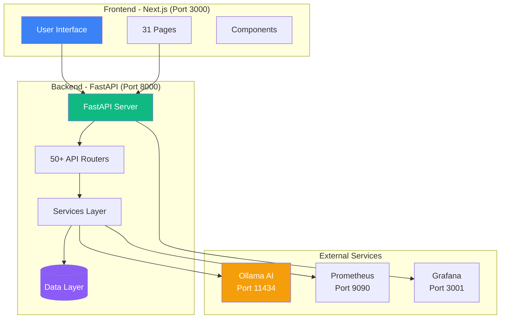
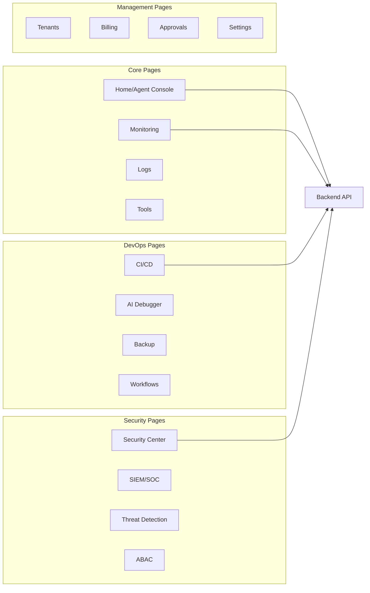
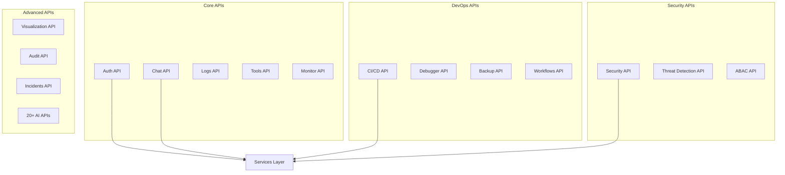
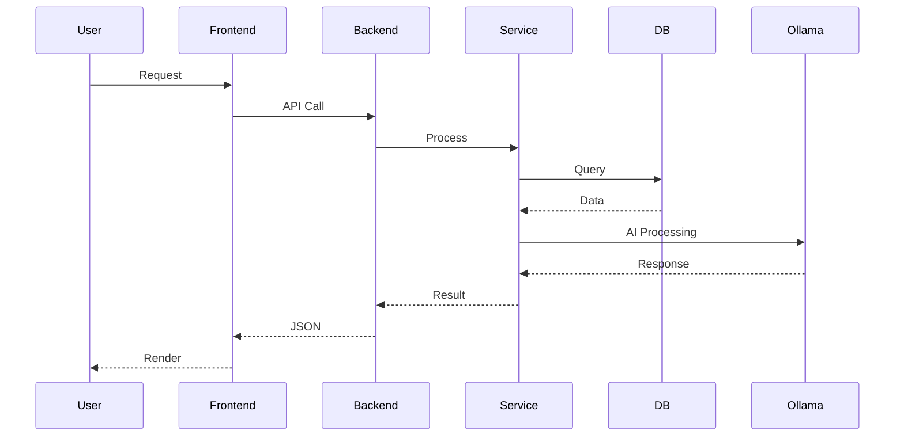

# AI Agent System - نظام الوكيل الذكي

## 📋 نظرة عامة

نظام شامل لإدارة وتشغيل AI Agent مع نظام صلاحيات موحد يتحكم بكل الواجهات والميزات.

## 🏗️ البنية

```
ai-agent/
├── backend/              # FastAPI Backend
│   ├── app/             # Application Code
│   ├── start.sh         # بدء Backend
│   ├── stop.sh          # إيقاف Backend
│   └── restart.sh       # إعادة تشغيل Backend
├── frontend/            # Next.js Frontend
│   ├── app/            # Next.js App
│   ├── start.sh        # بدء Frontend
│   ├── stop.sh         # إيقاف Frontend
│   └── restart.sh      # إعادة تشغيل Frontend
└── README.md           # هذا الملف
```

## 🚀 البدء السريع

### 1. تشغيل Backend

```bash
cd /home/ai/ai-agent/backend
./start.sh
```

الـ Backend سيعمل على: http://localhost:8000

### 2. تشغيل Frontend

```bash
cd /home/ai/ai-agent/frontend
./start.sh
```

الـ Frontend سيعمل على: http://localhost:3000

### 3. الوصول للنظام

- **Frontend**: http://localhost:3000
- **Backend API**: http://localhost:8000/api
- **API Docs**: http://localhost:8000/docs

## 📊 مخطط النظام الكامل

### البنية الأساسية



### الصفحات الرئيسية



### APIs الرئيسية



### تدفق البيانات



## 🔐 نظام الصلاحيات

النظام يحتوي على نظام صلاحيات موحد يتحكم بكل الواجهات:

### Agent Modes
- **Safe**: قراءة فقط، بدون run_shell
- **DevOps**: كل الصلاحيات مع approval للعمليات الخطيرة
- **Root**: كل الصلاحيات بدون قيود
- **Short**: جلسة واحدة بدون حفظ

### Memory Modes
- **Off**: لا حفظ
- **Short**: ذاكرة مؤقتة
- **Long**: حفظ طويل الأمد

## 🛠️ السكربتات المتاحة

### Backend Scripts

```bash
cd /home/ai/ai-agent/backend

./start.sh      # بدء Backend
./stop.sh       # إيقاف Backend
./restart.sh    # إعادة تشغيل Backend
```

### Frontend Scripts

```bash
cd /home/ai/ai-agent/frontend

./start.sh      # بدء Frontend
./stop.sh       # إيقاف Frontend
./restart.sh    # إعادة تشغيل Frontend
```

## 📡 API Endpoints الرئيسية

### Core APIs
- `GET /health` - فحص حالة النظام
- `POST /api/auth/login` - تسجيل الدخول
- `POST /api/chat` - محادثة مع AI Agent
- `GET /api/logs` - الحصول على السجلات
- `GET /api/monitor` - مراقبة النظام

### DevOps APIs
- `POST /api/cicd/deploy` - نشر التطبيقات
- `POST /api/debugger/analyze` - تحليل الأخطاء
- `POST /api/backup/create` - إنشاء نسخة احتياطية
- `POST /api/workflows/execute` - تنفيذ سير العمل

### Security APIs
- `POST /api/security/scan` - فحص الأمان
- `GET /api/threat-detection/alerts` - تنبيهات التهديدات
- `GET /api/abac/validate` - التحقق من الصلاحيات

### Management APIs
- `GET /api/billing/invoices` - الفواتير
- `POST /api/approvals/request` - طلب موافقة
- `GET /api/permissions/list` - قائمة الصلاحيات

## 🔧 الإعدادات

### Backend Settings

في `backend/memory/settings.json`:

```json
{
  "agent_mode": "devops",
  "memory_mode": "short",
  "allow_shell": false,
  "allow_read_file": true,
  "require_approval": ["run_shell", "write_file"]
}
```

### Frontend Settings

في `frontend/.env.local`:

```env
NEXT_PUBLIC_API_URL=http://localhost:8000/api
```

## ✅ Approval System

النظام يحتوي على نظام موافقات تلقائي:

1. العمليات الخطيرة تحتاج موافقة
2. يتم إنشاء pending action تلقائياً
3. Admin/DevOps يوافقون من Dashboard
4. بعد الموافقة، يتم التنفيذ تلقائياً

## 🔍 Troubleshooting

### Backend لا يعمل

```bash
cd /home/ai/ai-agent/backend
./stop.sh
./start.sh
```

**ملاحظة**: السكربتات تتحقق تلقائياً من Docker containers وتتعامل معها.

### Frontend لا يعمل

```bash
cd /home/ai/ai-agent/frontend
./stop.sh
./start.sh
```

### مشاكل Dependencies

إذا واجهت أخطاء مثل `ModuleNotFoundError`:

```bash
cd /home/ai/ai-agent/backend
python3 -m pip install -r requirements.txt
```

السكربت `start.sh` يتحقق تلقائياً من Dependencies ويقوم بتثبيتها إذا لزم الأمر.

### Port مستخدم

```bash
# Backend (8000)
lsof -ti:8000 | xargs kill -9

# Frontend (3000)
lsof -ti:3000 | xargs kill -9
```

### مشاكل الاتصال بين Frontend و Backend

1. تأكد من أن Backend يعمل: `curl http://localhost:8000/health`
2. تأكد من أن Frontend يعمل: `curl http://localhost:3000`
3. تحقق من CORS في Backend (يجب أن يكون `allow_origins=["*"]`)

## 📝 Logs

### Backend Logs
```bash
tail -f /home/ai/ai-agent/backend/backend.log
```

### Frontend Logs
```bash
tail -f /tmp/frontend.log
```

## 🔗 روابط مفيدة

- **Backend API Docs**: http://localhost:8000/docs
- **Backend Health**: http://localhost:8000/health
- **Frontend**: http://localhost:3000

## 📊 الميزات المتاحة

### Core Features
- ✅ Agent Console - واجهة المحادثة مع AI
- ✅ Monitoring - مراقبة النظام
- ✅ Logs - إدارة السجلات
- ✅ Tools - أدوات النظام

### DevOps Features
- ✅ CI/CD - النشر التلقائي
- ✅ AI Debugger - مصحح الأخطاء بالذكاء الاصطناعي
- ✅ Backup & Restore - النسخ الاحتياطي
- ✅ Workflows - إدارة سير العمل

### Security Features
- ✅ Security Center - مركز الأمان
- ✅ SIEM/SOC - مراقبة الأمان
- ✅ Threat Detection - كشف التهديدات
- ✅ ABAC - التحكم بالوصول المتقدم

### Management Features
- ✅ Tenants - إدارة المواقع
- ✅ Billing - إدارة الفواتير
- ✅ Approvals - نظام الموافقات
- ✅ Settings - الإعدادات

### Advanced Features
- ✅ Visualization - تصور البيانات
- ✅ Knowledge Base - قاعدة المعرفة
- ✅ Audit Trail - سجل التدقيق
- ✅ Incidents - إدارة الحوادث

### AI Advanced Features
- ✅ Cost Analyzer - تحليل التكاليف
- ✅ Performance Tuner - ضبط الأداء
- ✅ Global Search - البحث الشامل
- ✅ Snapshots & Rollback - اللقطات والتراجع
- ✅ Incident Command Center - مركز قيادة الحوادث
- ✅ Secret Management - إدارة الأسرار
- ✅ Service Dependency - تبعيات الخدمات
- ✅ Kernel Metrics - مقاييس النواة
- ✅ Auto-Hardening - التأمين التلقائي
- ✅ Shadow Deployment - النشر الخفي
- ✅ Behavior Alerts - تنبيهات السلوك
- ✅ Blueprint Generator - مولد المخططات
- ✅ Code Review - مراجعة الكود
- ✅ Plugin Store - متجر الإضافات
- ✅ Workflow Builder - بناء سير العمل
- ✅ Agent Mesh - شبكة الوكلاء
- ✅ Digital Twin - التوأم الرقمي

## 📄 الترخيص

هذا المشروع خاص.

## 👥 المساهمون

AI Agent Team

---

**ملاحظة**: تأكد من تشغيل Backend قبل Frontend للحصول على أفضل تجربة.
