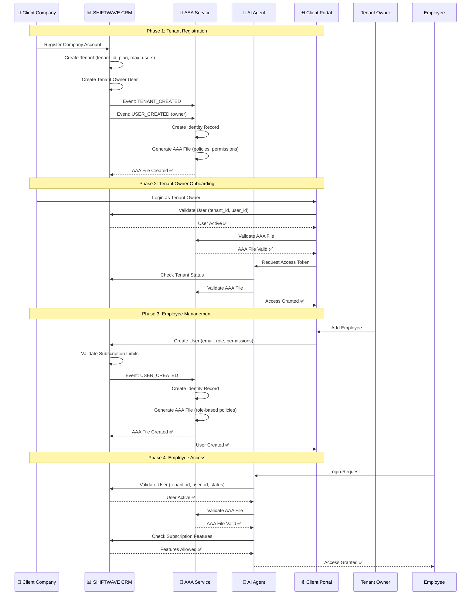
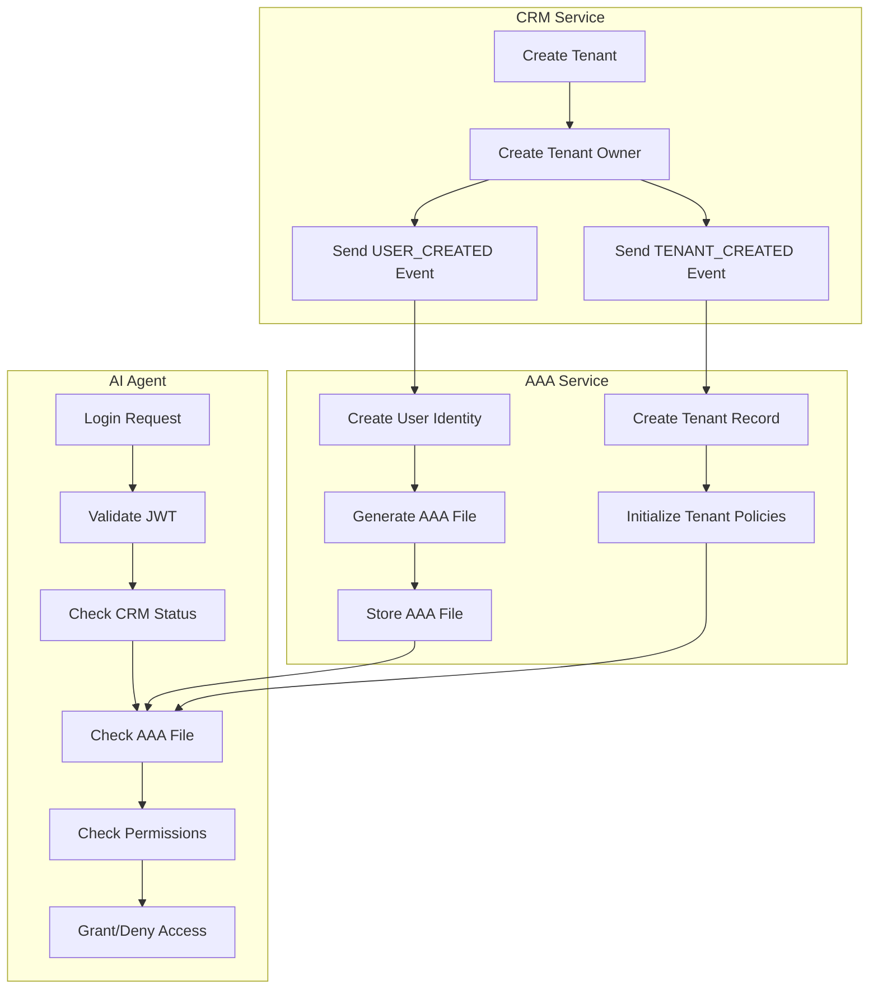

# 🚀 SaaS Onboarding Workflow - SHIFTWAVE AI Platform

## 📋 نظرة عامة

هذا المستند يوثق الـ workflow الكامل لـ **SaaS Multi-Tenant Onboarding** الذي يربط بين:
- **CRM (SHIFTWAVE CRM)** - Master Tenant Manager
- **AAA (Identity & Access Management)** - Technical Identity Provider
- **AI Agent** - Service Consumer

---

## 🎯 المبدأ الأساسي

```
CRM = Master Source of Truth (Business Identity)
  ↓
AAA = Technical Identity Provider (Policies & Permissions)
  ↓
AI Agent = Service Consumer (Validates & Enforces)
```

**القاعدة الذهبية:** 
> **AI Agent لا يقبل أي مستخدم إلا إذا كان موجوداً في CRM + AAA معاً**

---

## 📊 Workflow Diagram (Mermaid)



---

## 🔄 Detailed Workflow Steps

### Phase 1: Tenant Registration (CRM)

#### Step 1.1: Client Registers in CRM

**Endpoint:** `POST /api/crm/tenants`

**Request:**
```json
{
  "name": "شركة دجاجتي - فرع حلب",
  "type": "company",
  "contact_email": "owner@dajajati.com",
  "contact_phone": "+963123456789",
  "subscription_plan": "AI_AGENT_PRO",
  "max_users": 10
}
```

**CRM Actions:**
1. Create `Tenant` record:
   ```sql
   tenant_id = UUID()
   tenant_status = "active"
   plan = "AI_AGENT_PRO"
   max_users = 10
   features = ["ai.agent", "monitoring.basic", "logs.viewer"]
   ```

2. Create `Tenant Owner` user:
   ```sql
   user_id = UUID()
   email = "owner@dajajati.com"
   role = "tenant_owner"
   tenant_id = <tenant_id>
   status = "active"
   ```

3. Send events:
   ```json
   // Event 1: TENANT_CREATED
   {
     "event": "TENANT_CREATED",
     "tenant_id": "T-432",
     "plan": "AI_AGENT_PRO",
     "max_users": 10,
     "features": ["ai.agent", "monitoring.basic"]
   }

   // Event 2: USER_CREATED
   {
     "event": "USER_CREATED",
     "user_id": "U-123",
     "tenant_id": "T-432",
     "email": "owner@dajajati.com",
     "role": "tenant_owner",
     "permissions": ["*"],  // Full access
     "status": "active"
   }
   ```

---

### Phase 2: AAA Service Processing

#### Step 2.1: AAA Receives TENANT_CREATED Event

**Endpoint:** `POST /api/aaa/events/tenant-created`

**AAA Actions:**
1. Create tenant record in AAA database
2. Initialize tenant policies
3. Create tenant isolation rules

#### Step 2.2: AAA Receives USER_CREATED Event

**Endpoint:** `POST /api/aaa/events/user-created`

**AAA Actions:**
1. Create user identity record:
   ```json
   {
     "user_id": "U-123",
     "tenant_id": "T-432",
     "email": "owner@dajajati.com",
     "status": "active"
   }
   ```

2. Generate AAA File:
   ```json
   {
     "user_id": "U-123",
     "tenant_id": "T-432",
     "permissions": [
       "ai.agent.*",
       "monitoring.*",
       "logs.*",
       "users.create",
       "users.update",
       "users.delete"
     ],
     "abac_attributes": {
       "role": "tenant_owner",
       "department": null,
       "project": null
     },
     "policy_version": "1.0",
     "created_at": "2024-01-15T10:00:00Z",
     "expires_at": null
   }
   ```

3. Store AAA file in:
   - Database: `aaa_files` table
   - File system: `/vault/aaa/{tenant_id}/{user_id}.json` (optional)

4. Generate JWT signing keys:
   - `kid` (Key ID)
   - Public/Private key pair for tenant

---

### Phase 3: Tenant Owner Login

#### Step 3.1: Tenant Owner Logs into Client Portal

**Endpoint:** `POST /api/auth/login`

**Request:**
```json
{
  "email": "owner@dajajati.com",
  "password": "secure_password"
}
```

**Validation Flow:**

1. **CRM Validation:**
   ```python
   # Check if user exists and is active
   user = CRM.get_user(email)
   if not user or user.status != "active":
       return 401 Unauthorized
   
   # Check if tenant is active
   tenant = CRM.get_tenant(user.tenant_id)
   if not tenant or tenant.status != "active":
       return 403 Forbidden
   ```

2. **AAA Validation:**
   ```python
   # Check if AAA file exists
   aaa_file = AAA.get_aaa_file(user_id, tenant_id)
   if not aaa_file:
       return 403 Forbidden  # No AAA file = No access
   
   # Validate AAA file is not expired
   if aaa_file.expires_at and aaa_file.expires_at < now():
       return 403 Forbidden
   ```

3. **AI Agent Validation:**
   ```python
   # AI Agent receives JWT token
   token = verify_jwt(jwt_token)
   
   # Validate against CRM
   user = CRM.validate_user(token.user_id, token.tenant_id)
   if not user or user.status != "active":
       return 403 Forbidden
   
   # Validate against AAA
   aaa_file = AAA.get_aaa_file(token.user_id, token.tenant_id)
   if not aaa_file:
       return 403 Forbidden
   
   # Apply ABAC rules
   if not AAA.check_permission(aaa_file, requested_permission):
       return 403 Forbidden
   ```

4. **Response:**
   ```json
   {
     "access_token": "eyJhbGciOiJSUzI1NiIsInR5cCI6IkpXVCJ9...",
     "refresh_token": "eyJhbGciOiJSUzI1NiIsInR5cCI6IkpXVCJ9...",
     "user": {
       "email": "owner@dajajati.com",
       "name": "Owner Name",
       "role": "tenant_owner",
       "tenant_id": "T-432"
     }
   }
   ```

---

### Phase 4: Employee Management

#### Step 4.1: Tenant Owner Adds Employee

**Endpoint:** `POST /api/crm/tenants/{tenant_id}/users`

**Request:**
```json
{
  "email": "ahmed@dajajati.com",
  "full_name": "Ahmed Ali",
  "role": "analyst",
  "permissions": ["ai.agent.chat", "logs.viewer"],
  "department": "IT",
  "status": "active"
}
```

**CRM Actions:**
1. Validate subscription limits:
   ```python
   current_users = CRM.count_tenant_users(tenant_id)
   max_users = subscription.max_users
   if current_users >= max_users:
       return 400 Bad Request  # Subscription limit reached
   ```

2. Create user:
   ```sql
   user_id = UUID()
   email = "ahmed@dajajati.com"
   tenant_id = "T-432"
   role = "analyst"
   status = "active"
   ```

3. Send event to AAA:
   ```json
   {
     "event": "USER_CREATED",
     "user_id": "U-456",
     "tenant_id": "T-432",
     "email": "ahmed@dajajati.com",
     "role": "analyst",
     "permissions": ["ai.agent.chat", "logs.viewer"],
     "status": "active"
   }
   ```

#### Step 4.2: AAA Processes Employee User

**AAA Actions:**
1. Create identity record
2. Generate AAA file with role-based permissions:
   ```json
   {
     "user_id": "U-456",
     "tenant_id": "T-432",
     "permissions": [
       "ai.agent.chat",  // Only chat, not full AI agent
       "logs.viewer"     // Only view logs, not edit
     ],
     "abac_attributes": {
       "role": "analyst",
       "department": "IT",
       "project": null
     },
     "policy_version": "1.0"
   }
   ```

---

### Phase 5: Employee Access to AI Agent

#### Step 5.1: Employee Logs into AI Agent

**Endpoint:** `POST /api/auth/login`

**Request:**
```json
{
  "email": "ahmed@dajajati.com",
  "password": "employee_password"
}
```

**AI Agent Validation:**

1. **CRM Check:**
   ```python
   user = CRM.get_user("ahmed@dajajati.com")
   # Must be: active, tenant active, within subscription limits
   ```

2. **AAA Check:**
   ```python
   aaa_file = AAA.get_aaa_file(user_id, tenant_id)
   # Must exist and be valid
   ```

3. **Feature Check:**
   ```python
   # Check if requested feature is in subscription
   requested_feature = "ai.agent.chat"
   subscription_features = subscription.features
   if requested_feature not in subscription_features:
       return 403 Forbidden  # Feature not in subscription
   ```

4. **Permission Check:**
   ```python
   # Check if user has permission for requested feature
   if not AAA.check_permission(aaa_file, "ai.agent.chat"):
       return 403 Forbidden  # User doesn't have permission
   ```

5. **Success Response:**
   ```json
   {
     "access_token": "...",
     "user": {
       "email": "ahmed@dajajati.com",
       "role": "analyst",
       "tenant_id": "T-432",
       "permissions": ["ai.agent.chat", "logs.viewer"]
     }
   }
   ```

---

## 🔐 Security Rules

### Rule 1: No AAA File = No Access
```python
if not aaa_file:
    return 403 Forbidden
```

### Rule 2: CRM Status = Source of Truth
```python
if user.status != "active" or tenant.status != "active":
    return 403 Forbidden
```

### Rule 3: Subscription Features = Hard Limit
```python
if feature not in subscription.features:
    return 403 Forbidden
```

### Rule 4: AAA Permissions = Enforcement
```python
if not AAA.check_permission(aaa_file, permission):
    return 403 Forbidden
```

---

## 📁 API Endpoints Reference

### CRM Endpoints

#### Tenants
- `POST /api/crm/tenants` - Create tenant
- `GET /api/crm/tenants` - List tenants
- `GET /api/crm/tenants/{tenant_id}` - Get tenant details
- `PUT /api/crm/tenants/{tenant_id}` - Update tenant
- `DELETE /api/crm/tenants/{tenant_id}` - Delete tenant (soft delete)

#### Users
- `POST /api/crm/tenants/{tenant_id}/users` - Create user
- `GET /api/crm/tenants/{tenant_id}/users` - List users
- `GET /api/crm/tenants/{tenant_id}/users/{user_id}` - Get user details
- `PUT /api/crm/tenants/{tenant_id}/users/{user_id}` - Update user
- `DELETE /api/crm/tenants/{tenant_id}/users/{user_id}` - Delete user

#### Subscriptions
- `GET /api/crm/tenants/{tenant_id}/subscription` - Get subscription
- `PUT /api/crm/tenants/{tenant_id}/subscription` - Update subscription
- `POST /api/crm/tenants/{tenant_id}/subscription/upgrade` - Upgrade plan

#### Events (Internal)
- `POST /api/crm/events/tenant-created` - Trigger tenant creation event
- `POST /api/crm/events/user-created` - Trigger user creation event
- `POST /api/crm/events/user-updated` - Trigger user update event
- `POST /api/crm/events/user-deleted` - Trigger user deletion event

---

### AAA Endpoints

#### Events (Receive from CRM)
- `POST /api/aaa/events/tenant-created` - Process tenant creation
- `POST /api/aaa/events/user-created` - Process user creation
- `POST /api/aaa/events/user-updated` - Process user update
- `POST /api/aaa/events/user-deleted` - Process user deletion

#### AAA Files
- `GET /api/aaa/files/{tenant_id}/{user_id}` - Get AAA file
- `POST /api/aaa/files/{tenant_id}/{user_id}/regenerate` - Regenerate AAA file
- `GET /api/aaa/files/{tenant_id}` - List all AAA files for tenant

#### Policies
- `GET /api/aaa/policies/{tenant_id}` - Get tenant policies
- `PUT /api/aaa/policies/{tenant_id}` - Update tenant policies
- `POST /api/aaa/policies/{tenant_id}/validate` - Validate policy

#### Permissions
- `POST /api/aaa/permissions/check` - Check permission
- `GET /api/aaa/permissions/{tenant_id}/{user_id}` - Get user permissions

---

### AI Agent Endpoints

#### Authentication
- `POST /api/auth/login` - Login (validates CRM + AAA)
- `POST /api/auth/refresh` - Refresh token
- `GET /api/auth/me` - Get current user info

#### Authorization Middleware
- All endpoints use `get_current_user()` dependency
- Validates JWT → CRM → AAA → Permissions

#### Service Endpoints
- `POST /api/agent/chat` - AI chat (requires `ai.agent.chat`)
- `GET /api/logs` - View logs (requires `logs.viewer`)
- `GET /api/monitoring` - View monitoring (requires `monitoring.view`)

---

## 🗄️ Database Schema

### CRM Tables

#### `tenants`
```sql
CREATE TABLE tenants (
    id UUID PRIMARY KEY DEFAULT gen_random_uuid(),
    name VARCHAR(255) NOT NULL,
    type VARCHAR(50) NOT NULL,  -- 'company', 'government', 'individual'
    contact_email VARCHAR(255),
    contact_phone VARCHAR(50),
    status VARCHAR(50) DEFAULT 'active',  -- 'active', 'suspended', 'deleted'
    subscription_plan VARCHAR(100),  -- 'AI_AGENT_BASIC', 'AI_AGENT_PRO', 'AI_AGENT_ENTERPRISE'
    max_users INTEGER DEFAULT 5,
    features JSONB,  -- ["ai.agent", "monitoring.basic", ...]
    metadata JSONB,
    created_at TIMESTAMP DEFAULT NOW(),
    updated_at TIMESTAMP DEFAULT NOW()
);
```

#### `users`
```sql
CREATE TABLE users (
    id UUID PRIMARY KEY DEFAULT gen_random_uuid(),
    email VARCHAR(255) UNIQUE NOT NULL,
    password_hash VARCHAR(255) NOT NULL,
    full_name VARCHAR(255),
    status VARCHAR(50) DEFAULT 'pending',  -- 'pending', 'active', 'suspended', 'deleted'
    email_verified BOOLEAN DEFAULT FALSE,
    mfa_enabled BOOLEAN DEFAULT FALSE,
    mfa_secret VARCHAR(255),
    last_login_at TIMESTAMP,
    created_at TIMESTAMP DEFAULT NOW(),
    updated_at TIMESTAMP DEFAULT NOW()
);
```

#### `tenant_users`
```sql
CREATE TABLE tenant_users (
    id UUID PRIMARY KEY DEFAULT gen_random_uuid(),
    tenant_id UUID REFERENCES tenants(id) ON DELETE CASCADE,
    user_id UUID REFERENCES users(id) ON DELETE CASCADE,
    role VARCHAR(100) NOT NULL,  -- 'tenant_owner', 'admin', 'analyst', 'member'
    status VARCHAR(50) DEFAULT 'active',  -- 'active', 'suspended', 'deleted'
    permissions JSONB,  -- ["ai.agent.chat", "logs.viewer", ...]
    department VARCHAR(255),
    project VARCHAR(255),
    created_at TIMESTAMP DEFAULT NOW(),
    updated_at TIMESTAMP DEFAULT NOW(),
    UNIQUE(tenant_id, user_id)
);
```

#### `subscriptions`
```sql
CREATE TABLE subscriptions (
    id UUID PRIMARY KEY DEFAULT gen_random_uuid(),
    tenant_id UUID REFERENCES tenants(id) ON DELETE CASCADE,
    plan VARCHAR(100) NOT NULL,
    status VARCHAR(50) DEFAULT 'active',  -- 'active', 'suspended', 'cancelled', 'expired'
    features JSONB,  -- ["ai.agent", "monitoring.basic", ...]
    max_users INTEGER,
    billing_cycle VARCHAR(50),  -- 'monthly', 'yearly'
    current_period_start TIMESTAMP,
    current_period_end TIMESTAMP,
    created_at TIMESTAMP DEFAULT NOW(),
    updated_at TIMESTAMP DEFAULT NOW()
);
```

---

### AAA Tables

#### `aaa_files`
```sql
CREATE TABLE aaa_files (
    id UUID PRIMARY KEY DEFAULT gen_random_uuid(),
    tenant_id UUID NOT NULL,
    user_id UUID NOT NULL,
    file_content JSONB NOT NULL,  -- Full AAA file content
    policy_version VARCHAR(50) DEFAULT '1.0',
    permissions JSONB,  -- ["ai.agent.chat", "logs.viewer", ...]
    abac_attributes JSONB,  -- {"role": "analyst", "department": "IT"}
    expires_at TIMESTAMP,
    created_at TIMESTAMP DEFAULT NOW(),
    updated_at TIMESTAMP DEFAULT NOW(),
    UNIQUE(tenant_id, user_id)
);

CREATE INDEX idx_aaa_files_tenant_user ON aaa_files(tenant_id, user_id);
CREATE INDEX idx_aaa_files_expires ON aaa_files(expires_at) WHERE expires_at IS NOT NULL;
```

#### `aaa_policies`
```sql
CREATE TABLE aaa_policies (
    id UUID PRIMARY KEY DEFAULT gen_random_uuid(),
    tenant_id UUID NOT NULL,
    policy_name VARCHAR(255) NOT NULL,
    policy_content JSONB NOT NULL,  -- Policy rules
    version VARCHAR(50) DEFAULT '1.0',
    is_active BOOLEAN DEFAULT TRUE,
    created_at TIMESTAMP DEFAULT NOW(),
    updated_at TIMESTAMP DEFAULT NOW()
);

CREATE INDEX idx_aaa_policies_tenant ON aaa_policies(tenant_id);
```

#### `aaa_sessions`
```sql
CREATE TABLE aaa_sessions (
    id UUID PRIMARY KEY DEFAULT gen_random_uuid(),
    tenant_id UUID NOT NULL,
    user_id UUID NOT NULL,
    access_token_hash VARCHAR(255) NOT NULL,
    refresh_token_hash VARCHAR(255),
    device_info VARCHAR(500),
    ip_address VARCHAR(50),
    user_agent VARCHAR(500),
    expires_at TIMESTAMP NOT NULL,
    created_at TIMESTAMP DEFAULT NOW(),
    last_activity_at TIMESTAMP DEFAULT NOW()
);

CREATE INDEX idx_aaa_sessions_user ON aaa_sessions(tenant_id, user_id);
CREATE INDEX idx_aaa_sessions_expires ON aaa_sessions(expires_at);
```

---

### AI Agent Tables

#### `audit_logs`
```sql
CREATE TABLE audit_logs (
    id UUID PRIMARY KEY DEFAULT gen_random_uuid(),
    tenant_id UUID,
    user_id UUID,
    action VARCHAR(255) NOT NULL,
    resource_type VARCHAR(100),
    resource_id UUID,
    details JSONB,
    ip_address VARCHAR(50),
    user_agent VARCHAR(500),
    created_at TIMESTAMP DEFAULT NOW()
);

CREATE INDEX idx_audit_logs_tenant ON audit_logs(tenant_id);
CREATE INDEX idx_audit_logs_user ON audit_logs(user_id);
CREATE INDEX idx_audit_logs_created ON audit_logs(created_at);
```

---

## 📂 Folder Structure

```
ai-agent/
├── backend/
│   ├── app/
│   │   ├── api/
│   │   │   ├── auth.py              # Authentication endpoints
│   │   │   ├── crm_api.py           # CRM endpoints
│   │   │   ├── identity_api.py      # Identity endpoints
│   │   │   ├── access_api.py        # Access control endpoints
│   │   │   └── policy_api.py         # Policy endpoints
│   │   │
│   │   ├── crm/                     # CRM Service
│   │   │   ├── service.py           # CRM business logic
│   │   │   ├── schemas.py           # CRM data schemas
│   │   │   └── events.py             # Event handlers
│   │   │
│   │   ├── identity/                # Identity Service (AAA)
│   │   │   ├── service.py           # Identity business logic
│   │   │   ├── models.py            # Identity database models
│   │   │   ├── schemas.py           # Identity data schemas
│   │   │   ├── aaa_file_generator.py # AAA file generation
│   │   │   └── policy_engine.py     # Policy evaluation engine
│   │   │
│   │   ├── access/                  # Access Control
│   │   │   ├── service.py           # Access control logic
│   │   │   ├── models.py            # Access models
│   │   │   └── abac.py              # ABAC implementation
│   │   │
│   │   ├── policy/                  # Policy Management
│   │   │   ├── service.py           # Policy service
│   │   │   ├── engine.py            # Policy engine
│   │   │   └── models.py            # Policy models
│   │   │
│   │   ├── subscription/             # Subscription Management
│   │   │   ├── service.py           # Subscription service
│   │   │   ├── models.py            # Subscription models
│   │   │   └── schemas.py           # Subscription schemas
│   │   │
│   │   ├── core/
│   │   │   ├── aaa_middleware.py    # AAA validation middleware
│   │   │   ├── security.py          # JWT, password hashing
│   │   │   └── database.py          # Database connection
│   │   │
│   │   └── agent/                   # AI Agent core
│   │       ├── agent.py             # Main agent logic
│   │       └── tools/               # Agent tools
│   │
│   └── vault/                       # Secrets & AAA files storage
│       ├── aaa/                     # AAA files
│       │   ├── {tenant_id}/
│       │   │   └── {user_id}.json
│       └── keys/                    # JWT signing keys
│           └── {tenant_id}/
│               ├── private.pem
│               └── public.pem
│
└── frontend/
    ├── app/
    │   ├── crm/                     # CRM Frontend
    │   │   ├── tenants/             # Tenant management
    │   │   ├── users/                # User management
    │   │   └── subscriptions/       # Subscription management
    │   │
    │   ├── aaa/                     # AAA Frontend
    │   │   ├── users/                # User management
    │   │   ├── policies/             # Policy management
    │   │   └── audit/                # Audit logs
    │   │
    │   └── agent/                   # AI Agent Frontend
    │       ├── chat/                 # AI chat interface
    │       ├── monitoring/           # Monitoring dashboard
    │       └── logs/                 # Logs viewer
```

---

## 🔄 Event Flow Diagram



---

## ✅ Validation Checklist

### For Every Request to AI Agent:

- [ ] JWT token is valid and not expired
- [ ] User exists in CRM and status = "active"
- [ ] Tenant exists in CRM and status = "active"
- [ ] AAA file exists for user + tenant
- [ ] AAA file is not expired
- [ ] Subscription is active
- [ ] Requested feature is in subscription plan
- [ ] User has permission for requested action (ABAC check)
- [ ] Tenant has not exceeded user limits

---

## 🚨 Error Codes

| Code | Message | Meaning |
|------|---------|---------|
| `401` | Unauthorized | Invalid credentials |
| `403` | Forbidden | User/tenant inactive or no AAA file |
| `403` | Feature not in subscription | Requested feature not available in plan |
| `403` | Permission denied | User doesn't have required permission |
| `404` | User not found | User doesn't exist in CRM |
| `404` | Tenant not found | Tenant doesn't exist in CRM |
| `404` | AAA file not found | AAA file doesn't exist |
| `429` | Too many requests | Rate limit exceeded |
| `500` | Internal server error | System error |

---

## 📝 Example Scenarios

### Scenario 1: New Tenant Onboarding

1. **Client registers** → CRM creates tenant + owner
2. **CRM sends events** → AAA creates identity + AAA file
3. **Owner logs in** → AI Agent validates → Access granted ✅

### Scenario 2: Employee Added

1. **Owner adds employee** → CRM creates user
2. **CRM sends event** → AAA creates AAA file with limited permissions
3. **Employee logs in** → AI Agent validates → Access granted (limited) ✅

### Scenario 3: Subscription Upgrade

1. **Owner upgrades plan** → CRM updates subscription
2. **CRM sends event** → AAA updates policies
3. **Users get new features** → AI Agent validates new permissions ✅

### Scenario 4: User Suspended

1. **Owner suspends user** → CRM updates user status = "suspended"
2. **CRM sends event** → AAA marks AAA file as inactive
3. **User tries to login** → AI Agent validates → Access denied ❌

---

## 🎯 Key Takeaways

1. **CRM is Master** - All user/tenant creation happens in CRM
2. **AAA is Enforcer** - All permissions come from AAA files
3. **AI Agent is Validator** - Never trusts, always validates
4. **No AAA = No Access** - This is the golden rule
5. **Subscription = Feature Gate** - Features are gated by subscription plan
6. **ABAC = Fine-grained Control** - Permissions are attribute-based

---

**تم إنشاء هذا المستند بواسطة:** Shiftwave Team  
**آخر تحديث:** 2024-01-15  
**الإصدار:** 1.0.0

